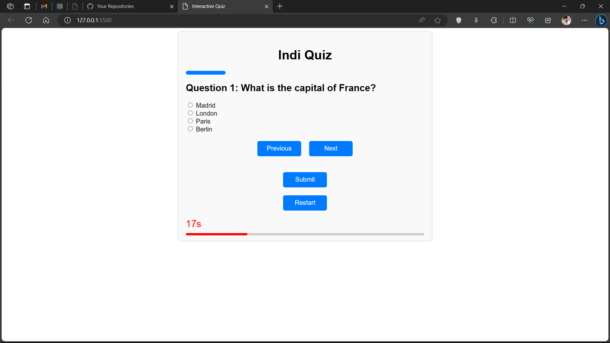

# indi Quiz

This is a simple web application for hosting quizzes. Users can answer multiple-choice questions and receive instant feedback on their choices. The quiz also includes a timer, progress tracker, and the ability to navigate through questions.

## Features

- Display questions and answer options
- Validate and provide feedback on selected answers
- Keep track of the user's score
- Provide navigation through questions
- Display final score upon completion
- Suffle questions

## Getting Started

### Usage

1. Clone or download this repository.
2. Open `index.html` in a web browser.

## How It Works

- The quiz is built using HTML for structure, CSS for styling, and JavaScript for interactivity.
- Questions and answers are defined in the `script.js` file.
- User interactions (selecting answers, navigating questions) are handled with JavaScript.

## Customizing the Quiz

You can customize the quiz by modifying the `script.js` file:

- Add or change questions, answer options, and correct answers.
- Adjust the timer duration, styling, or any other behavior.
